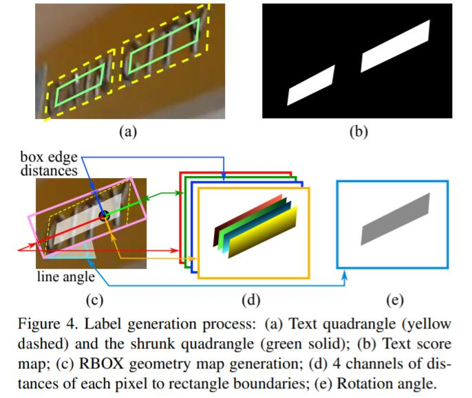
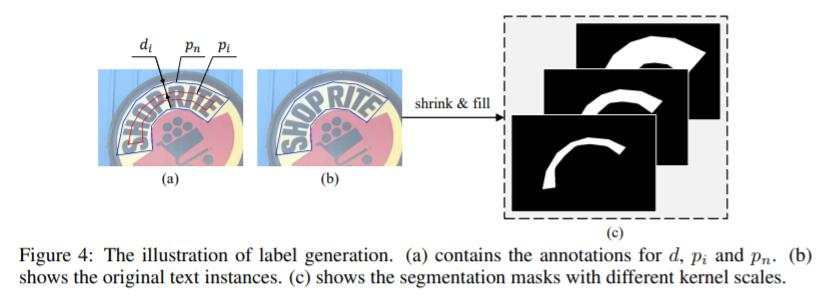
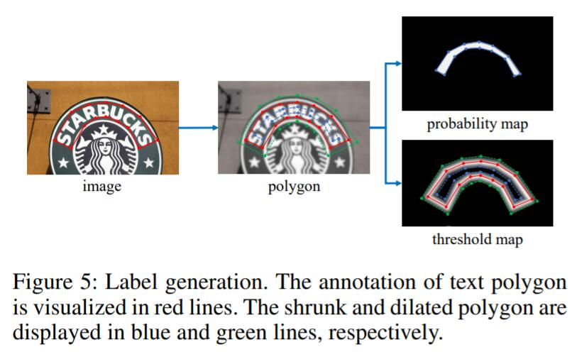

# Real time text detection via segmentation

## backbone选择

* 轻量级系列
    * mobilenet
    * ShuffleNet

* 服务端
    * vgg
    * resnet
    * senet
    * efficientnet
    * 其它有调整的类似结构

## neck部分
通常是对backbone中抽出来的1/2 1/4 1/8 1/16 1/32等feature maps进行一系列的操作，典型套路：multi-scale fusion
enlarge receptive field、high solution low solution info fusion，典型结构FPN。

## head部分
通常会根据label的设置方式有不同channel个数的输出

## label产生方式

* east(RBOX)
    1+4+1,一个缩小的score map，文字区域的点到四条边的距离（归一化），文字行角度的map
    
    
* psenet
    多组渐进式的score map，实际使用中，使用2~3组就可以了
    
    
* dbnet
    2+1，一组缩小的score map，一组文字行边界的值向两侧递减的“距离”，前两个计算一个1/(1+exp(-k*(score_map-dist_map)))
    

## loss函数
* east: score map dice coefficient，其它的map是类dice的操作交并比
* psenet： dice coefficient
* dbnet：bce loss + l1 loss
* 针对score map的话，balanced cross-entropy loss和dice coefficient按道理都是可行的

## 分割类分析与总结
* psenet和dbnet可以统一起来看待，pse强调粘连问题的解决，实际上对文字行粘连问题的解决有一定的局限性，依赖于最小score map的是否存在粘连，dbnet也是如此，因此最小score map上的分割效果对判断后续的文字行是否粘连或者断开具有决定性的作用，可以做一种极限化处理，用一条厚度适中的线条作为最小的map进行训练。

* 在最后的文字行位置提取环节，pse和dbnet在利用score map得出文字行位置的方法略有区别，pse使用渐进式的扩张得到最后的map，dbnet则是直接将score map按照训练时的缩放比进行放大，然后得到文字行位置

* pse渐进式的缺点：文字行的检测框容易顶着，可以解决掉；

* dbnet后处理缺点：dbnet直接按缩放比放大score map将过于依赖score map的分割效果

## 从别的角度看psenet的潜在优点
* 从投票决策的角度看，psenet有多组map可以共同来确定最终的文字行位置，避免了dbnet中仅仅依靠一组map确定的风险；

* psenet由大到小的score map分割方式体现一种“由粗到细”，由大致位置再到精细位置的过程，另外，直接学习缩小的score map本来就是一个前景背景失衡的问题，如果先使用原始的文字行的score map来粗学习，可以从一定程度上减少这种失衡

* 两全其美的解决方案：
    * 将dbnet的label产生方式也应用到psenet中，这样最后可以学出一组关于文字行真实边界的distance map图，由文字行边界向两边递减，这样就可以辅助式的解决pse顶格的问题

## OCR检测展望

* 将文字的方向判断也糅合到文字行分割里面来；（业务对应：图片/视频的安全审核，与文字相关的特征工程，为视频搜索或者打tag提供关键的高级特征）
    * 单幅图像中的文字行不具有同一性，垂直、水平、翻转、镜像全出现在一张图上
    * **可以有一种文字行位置+文字方向的检测方案，目前正在验证中**
* 配合语义信息的文字行检测；（有助于提高回帖和翻译）

## 参考

* [EAST](https://arxiv.org/pdf/1704.03155.pdf)
* [PSENet](https://arxiv.org/pdf/1806.02559.pdf)
* [DBNet](https://arxiv.org/pdf/1911.08947.pdf)
